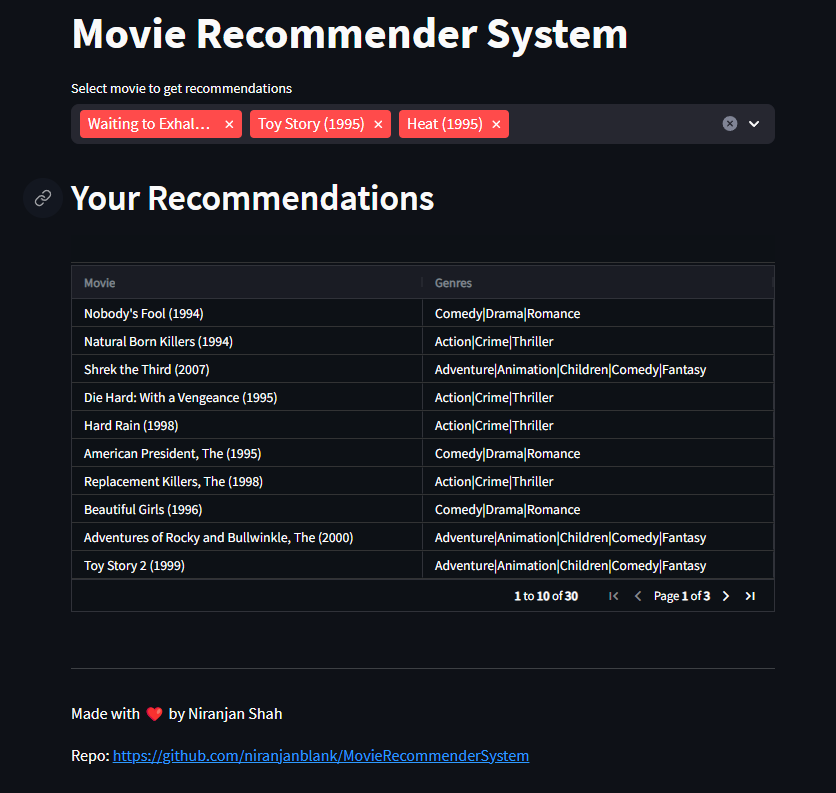

# Movie Recommender System

## Introduction
This project is a movie recommendation system built using Python, pandas, scikit-learn, streamlit-aggrid and Streamlit. It uses the MovieLens 100k dataset to train a content-based model that recommends movies based on their genres.

## Features
* Content-Based Recommender: The system recommends movies similar to a user's initial picks based on their genres.
* Streamlit Webapp: This app was created using streamlit which allows user to select their favorite movies, and get recommendations based on those movies.

## Screenshot

## Getting Started
### Prerequisites
You will need Python 3.8 or above and the following Python packages: pandas, numpy, scikit-learn, and streamlit.

### Installation
1. Clone this repo
2. Install the required packages
3. Download the movielens100k dataset for training and other uses, and place the dataset in dataset folder
4. Create a matrices folder to save _cosine_sim_ and _tfidf_matrix_
5. Run [recommender_system_training.ipynb](recommender_system_training.ipynb) to generate and saved the matrices needed for this project
6. Run the streamlit app using `streamlit run app.py`

## Dataset
The dataset used in this project is the [MovieLens 100k dataset](https://grouplens.org/datasets/movielens/100k/), which consists of 100,000 ratings from 943 users on 1682 movies. The genre information of the movies is used to recommend similar movies.

## Model
The recommendation system is built using a TF-IDF vectorizer to convert genres into vectors and cosine similarity to determine the similarity between different movies.

## Author
Niranjan Shah

## Acknowledgement
The [MovieLens 100k](https://grouplens.org/datasets/movielens/100k/) dataset was provided by GroupLens.

